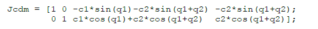
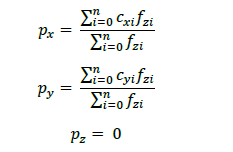
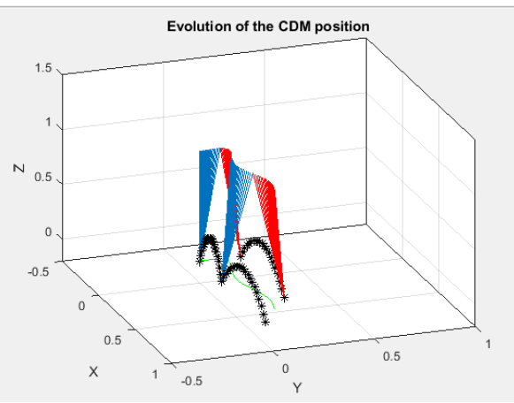

# Commande-avanc-CDM
The goal of this lab is to trace the evolution of a humanoid robot on MATLAB.

## Description
This project is a simmulator of the evolution of the center of mass of a humanoid robot. 
If you want to use it, you fist need to install MATLAB, then you need to open the main.m file and run the code.

The Jacobian formula used to calcul the center of mass is the next one:

The file ZMP.m is used to resolve the next equation:

With c the contact point vector and f the force vector of the point at the position of the vector c.

The file TrajectoireCDM is used in order to obtain the trajectory of the CoM (Center of Mass).

The result is this graph:

In black you have the position of the robot foot in each times, in green you have the position of the CoM in 2D axis, finnaly you have the vector of the CoM in red (when the robot moves his right foot) and blue (when the robot moves his left foot).

